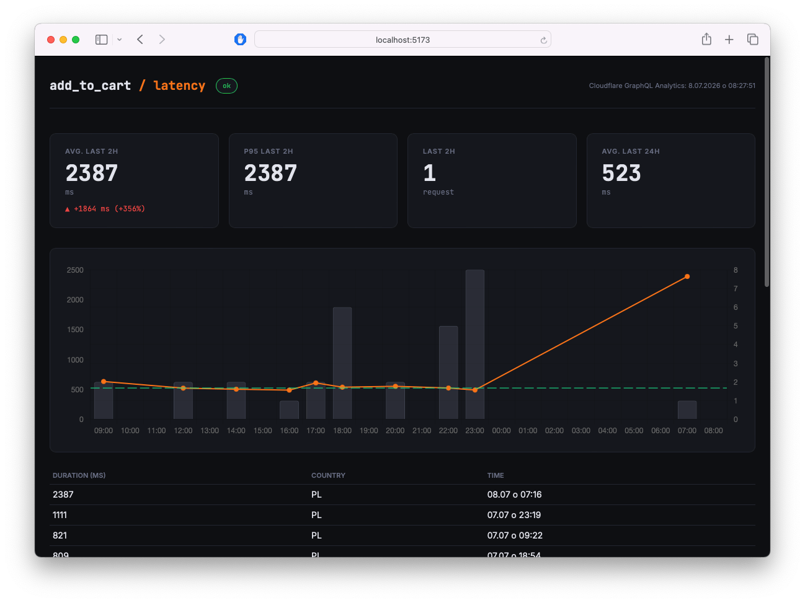

# ATC Monitor Dashboard

A small observability dashboard that monitors `wc_ajax=add_to_cart` request latency using Cloudflare's GraphQL Analytics API. Shows request counts and latency (median, p95) over the last 24h, refreshing automatically every 5 minutes.



## Structure

```
project/
  api/        PHP endpoint that proxies Cloudflare's GraphQL API
  app/        Vite + React + TypeScript frontend
  .env        Local config
```

## Development

### Frontend (`app/`)

```bash
cd app
npm install
npm run dev       # starts Vite dev server with proxy to the PHP API
npm run test      # runs vitest
npm run build     # production build, outputs to app/dist/
npm run lint
```

### API (`api/`)

```bash
cd api
php -S localhost:9000
```

The Vite dev server proxies `/api/*` requests to `localhost:9000`, so run both servers side by side during development.

## Environment Variables

The PHP endpoint reads config from a `.env` file located **one directory above the webroot**.

| Key           | Description                                     |
| ------------- | ----------------------------------------------- |
| `ENV`         | `development` or `production`                   |
| `CF_TOKEN`    | Cloudflare API token with Analytics read access |
| `CF_ZONE_TAG` | Cloudflare zone ID to query                     |
| `CF_ENDPOINT` | Cloudflare GraphQL endpoint URL                 |

## Deployment

1. `cd app && npm run build`
2. Upload `app/dist/` and `api/cf.php` contents to the target subfolder on the server
3. Place the `.env` file one directory above webroot on the server
